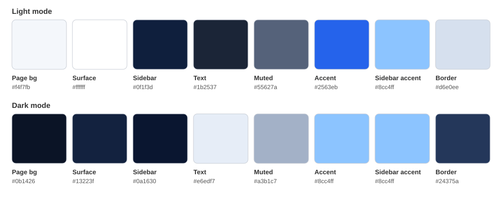
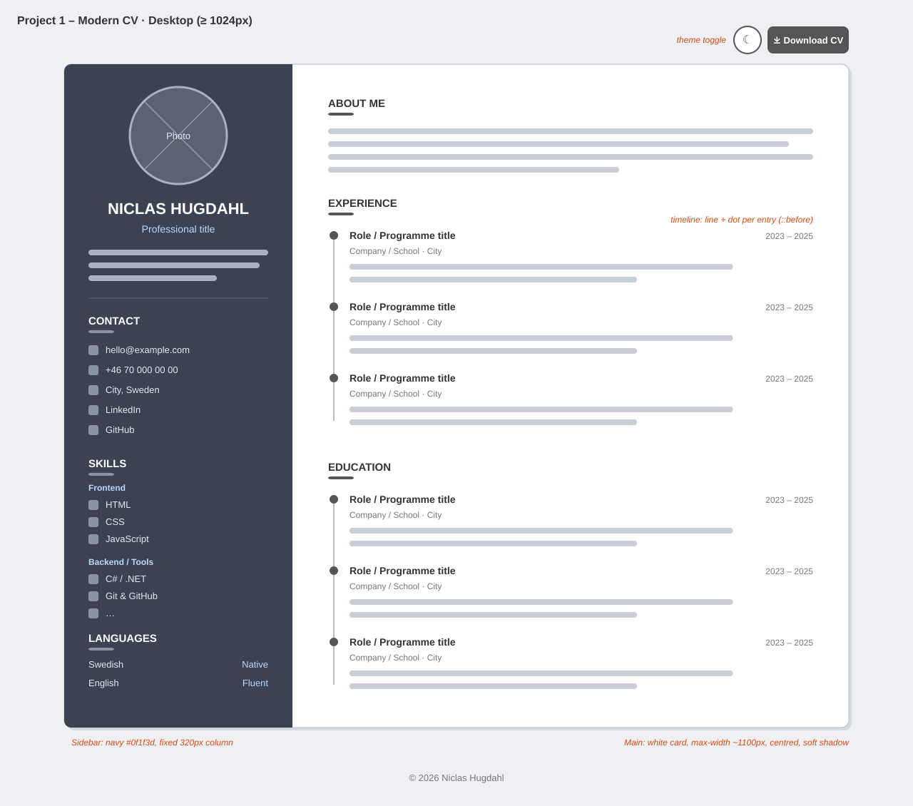
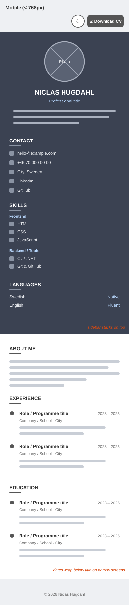

# Modern CV – Niclas Hugdahl

TODO: Am I Responsive screenshot → `readme-assets/screenshots/am-i-responsive.png`

<!--  -->

Link to live website: TODO add Vercel URL

## Table of contents

* [User Experience (UX)](#user-experience-ux)
    * [User stories](#user-stories)
        * [Site owner goals](#site-owner-goals)
        * [Visitor goals](#visitor-goals)
* [Design](#design)
    * [Colours](#colours)
    * [Typography](#typography)
    * [Images](#images)
    * [Wireframes](#wireframes)
    * [Accessibility](#accessibility)
* [Features](#features)
    * [The profile header](#the-profile-header)
    * [The sidebar: contact, skills and languages](#the-sidebar-contact-skills-and-languages)
    * [About me](#about-me)
    * [Experience and education timeline](#experience-and-education-timeline)
    * [Dark mode](#dark-mode)
    * [Download CV](#download-cv)
    * [The footer](#the-footer)
* [Future features](#future-features)
* [Technologies used](#technologies-used)
    * [Languages](#languages)
    * [Frameworks & Tools](#frameworks--tools)
* [Testing](#testing)
* [Deployment](#deployment)
    * [Local development](#local-development)
* [Credits](#credits)
    * [Content](#content)
    * [Media](#media)
    * [Code](#code)

## User Experience (UX)

This is a one-page CV website that presents Niclas Hugdahl as a developer in
a clean, modern and professional way. The design is inspired by modern Canva
CV templates, with a dark navy sidebar and a light main column.

The site is for recruiters, employers and teachers who want a quick overview
of Niclas's skills, experience and education, on any device.

The project was built as Project 1 of the frontend part of the C# course at
Lexicon, to practise semantic HTML, CSS layout (Flexbox and Grid), UI design
and responsive design.

### User stories

#### Site owner goals
- Present my skills, experience and education in a clear, professional way
- Make a good first impression with a modern, consistent design
- Let visitors download my CV as a PDF
- Make the site work well on mobile, tablet and desktop
- Make the site accessible to everyone
- Keep personal contact information safe by only publishing placeholders

#### Visitor goals
- Quickly understand who Niclas is and what he does
- Scan skills, experience and education without scrolling through clutter
- Find ways to get in touch
- Download the CV to save or share it
- Read the page comfortably in both light and dark mode

## Design

### Colours

The colour scheme is built around a dark navy, with lighter blue accents
for a calm and professional feel. Each colour is stored as a CSS custom
property, and dark mode swaps the values. All text colours meet WCAG AA
contrast.

| Role | Light mode | Dark mode |
|------|-----------|-----------|
| Page background | `#f4f7fb` | `#0b1426` |
| Card / main column | `#ffffff` | `#13223f` |
| Sidebar (navy) | `#0f1f3d` | `#0a1630` |
| Text | `#1b2537` | `#e6edf7` |
| Muted text | `#55627a` | `#a3b1c7` |
| Accent | `#2563eb` | `#8cc4ff` |
| Sidebar accent | `#8cc4ff` | `#8cc4ff` |

### Typography

Two modern, very readable Google Fonts:
- **Sora** is used for headings: geometric and modern, with strong character in the name and section titles (sans-serif as backup font)
- **Inter** is used for body text: designed for screens and easy to read at small sizes (sans-serif as backup font)

### Images

TODO: describe the profile photo (currently a placeholder) and the favicon.

### Wireframes

Wireframes were made before coding, for mobile and desktop. On tablet
(≥768px) the sidebar content is placed in a grid with contact, skills and
languages side by side.

Desktop wireframe (≥1024px)
 

 

Mobile wireframe (&lt;768px)
 

 

### Accessibility

Semantic HTML (`header`, `main`, `section`, `address`, `time`, `footer`) with
a logical heading order helps screen reader users and search engines.
The profile photo has alternative text, decorative icons are hidden from
screen readers, and the icon-only theme button has an `aria-label`.
All buttons and links have visible focus styles, and colour contrast meets
WCAG AA in both light and dark mode.

Hover effects are only used on buttons. Nothing else changes on hover, so
users are never misled into thinking a heading or the photo is clickable.

TODO: add screenshot examples of responsive behaviour from mobile to tablet to desktop.

<!-- 

Screenshot examples of responsive behavior
 

 
 -->

## Features

### The profile header

The profile header sits at the top of the navy sidebar. It shows the
profile photo, name, professional title and a short summary, so visitors
see the most important information first.

TODO: screenshot

### The sidebar: contact, skills and languages

The sidebar holds contact details (placeholders), grouped skills with icons,
and languages. On desktop it is a full-height navy column. On tablet the
three sections sit side by side, and on mobile they stack.

TODO: screenshot

### About me

TODO: short description + screenshot

### Experience and education timeline

Experience and education are shown as a vertical timeline with a line and
a dot for each entry, made with CSS pseudo-elements. Role, organisation and
dates are easy to scan.

TODO: screenshot

### Dark mode

A theme toggle button switches between light and dark mode. By default the
site follows the visitor's operating system setting, and the choice is saved
in the browser so it is remembered on the next visit.

TODO: screenshot of light vs dark

### Download CV

The Download CV button downloads a PDF version of the CV. The PDF contains
the same placeholder contact information as the website.

TODO: screenshot

### The footer

TODO: short description + screenshot

## Future features
- TODO: add ideas that come up during development

## Technologies used

### Languages
- HTML
- CSS
- JavaScript (theme toggle only)

### Frameworks & Tools

- Git
- GitHub
- Vercel
- Google Fonts
- Font Awesome
- VS Code
- Claude Code
- TODO: add any other tools used (favicon generator, image converter, etc.)

## Testing

Testing made in separate file [testing.md](testing.md)

## Deployment

This project lives in the monorepo
[frontend-projects](https://github.com/NiclO1337/frontend-projects), in the
folder `project1-modern-cv-webpage`. Changes were continuously pushed to
GitHub for source control. 
The site is deployed to Vercel as its own project. The steps to deploy are as follows:
- Log in to Vercel with GitHub, click **Add New → Project** and import the `frontend-projects` repository
- Set **Root Directory** to `project1-modern-cv-webpage`
- Set **Framework Preset** to **Other** (no build command is needed for a static site)
- Click **Deploy**. Vercel redeploys automatically on every push to `main`

Link to live website: TODO add Vercel URL

### Local development

#### Forking the project for local development

- Log in (or sign up) to GitHub.
- Go to the repository for this project, [link to repository](https://github.com/NiclO1337/frontend-projects)
- Click the Fork button in the top right corner.

#### Cloning the project for local development

- Log in (or sign up) to GitHub.
- Go to the repository for this project, [link to repository](https://github.com/NiclO1337/frontend-projects)
- Click on the code button, select whether you would like to clone with HTTPS, SSH, or GitHub CLI, and copy the link shown.
- Open the terminal in your code editor and change the current working directory to the location you want to use for the cloned directory.
- Type `git clone` into the terminal and then paste the link you copied in step 3.
- Press enter.
- Open `project1-modern-cv-webpage/index.html` in a browser.

## Credits

### Content
- All CV content is my own.

### Media
- TODO: profile photo credit (own photo or placeholder source)
- Icons from [Font Awesome](https://fontawesome.com/)
- Fonts from [Google Fonts](https://fonts.google.com/): Sora and Inter

### Code
- Layout inspired by modern CV templates on [Canva](https://www.canva.com/)
- Took inspiration from Kera Cudmore's very comprehensive README guide: [Readme examples.](https://github.com/kera-cudmore/readme-examples)
- TODO: add tutorials, videos or articles used during development
