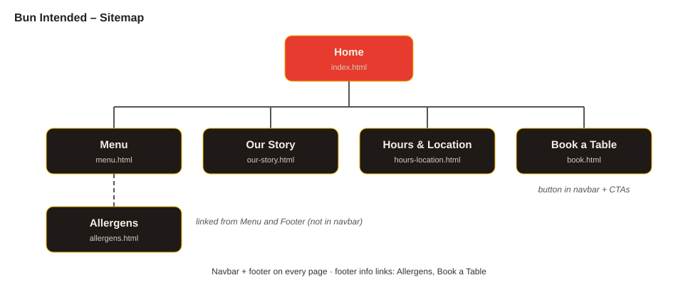
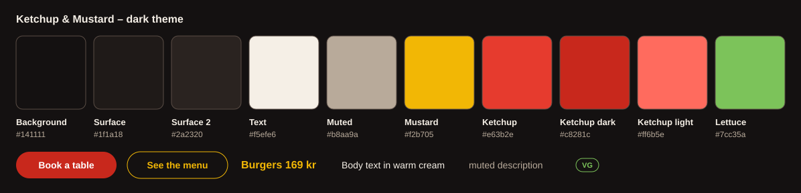
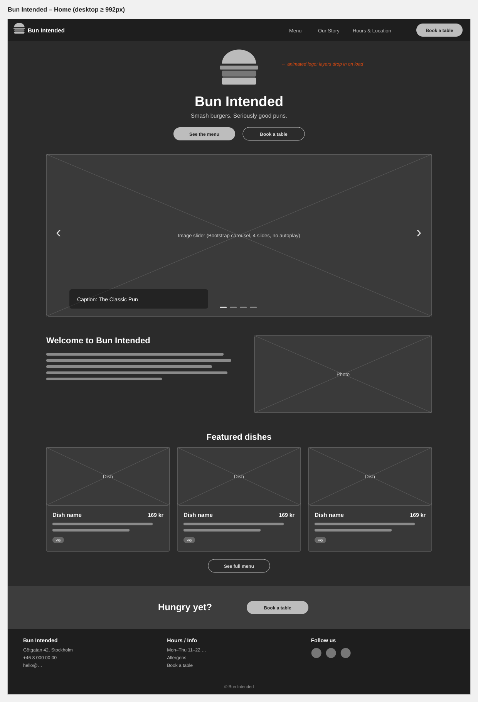
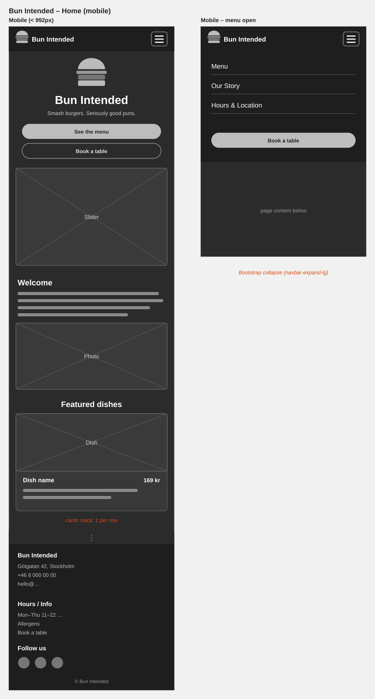
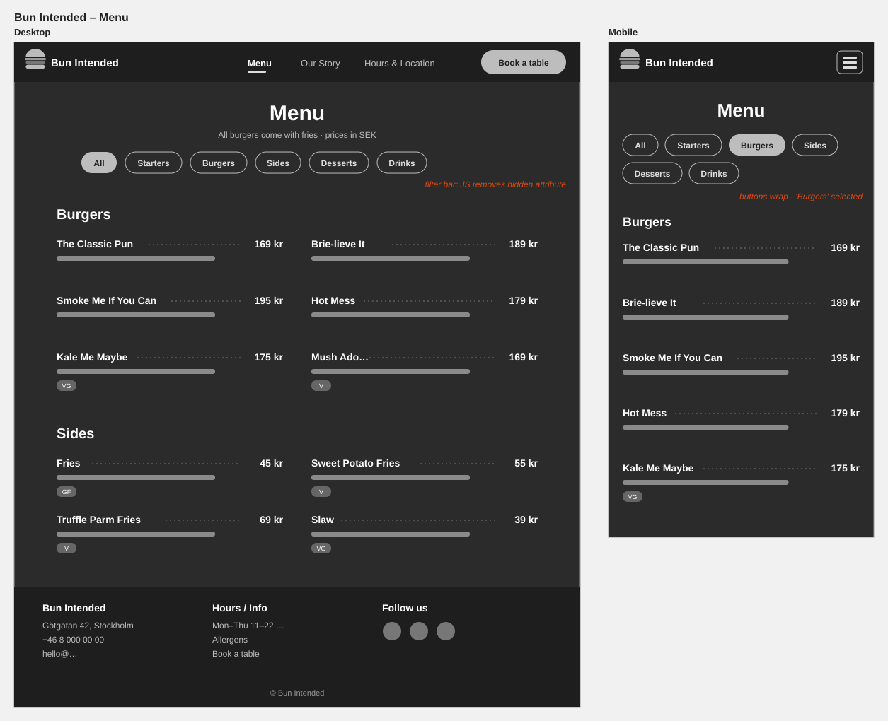
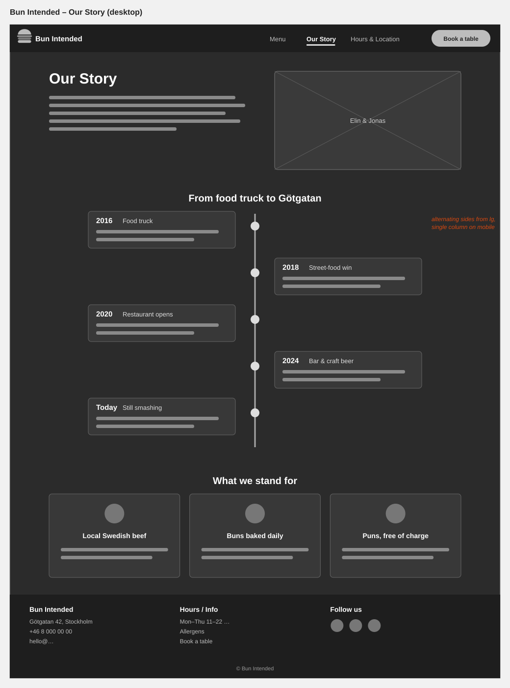
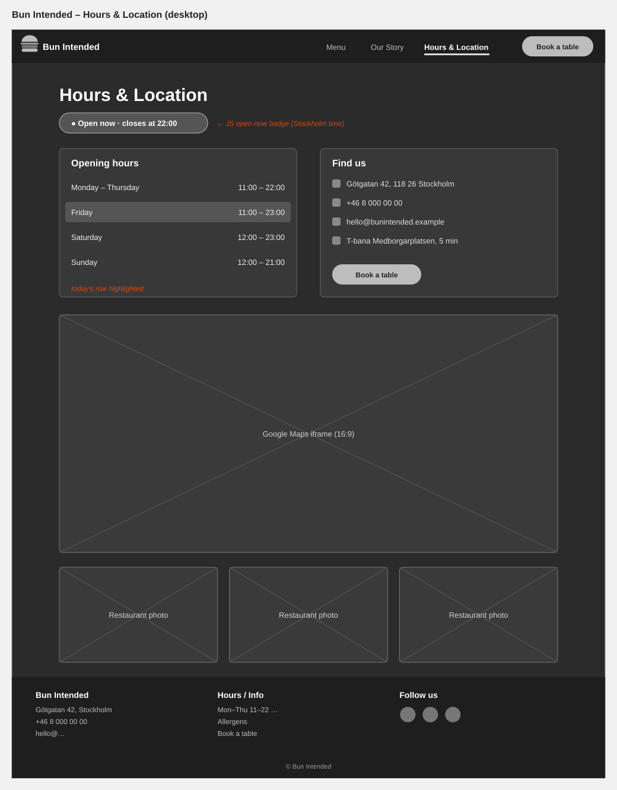
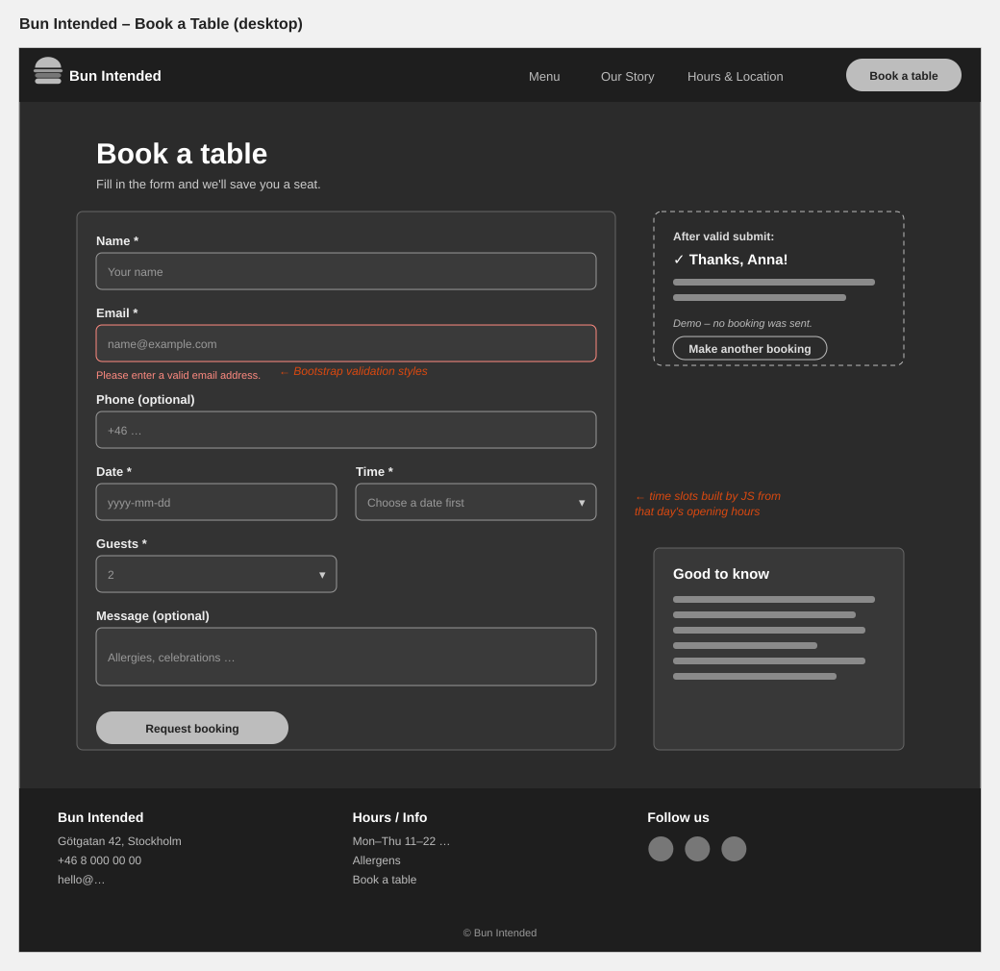

# Bun Intended – Smash burgers. Seriously good puns.

TODO: Am I Responsive screenshot → `readme-assets/screenshots/am-i-responsive.png`

<!--  -->

Link to live website: [Bun Intended](https://frontend-projects-project2-modern-b.vercel.app/)

## Table of contents

* [User Experience (UX)](#user-experience-ux)
    * [The business](#the-business)
    * [User stories](#user-stories)
        * [Business goals](#business-goals)
        * [Customer goals](#customer-goals)
* [Design](#design)
    * [Sitemap](#sitemap)
    * [Colours](#colours)
    * [Typography](#typography)
    * [The logo](#the-logo)
    * [Images](#images)
    * [Wireframes](#wireframes)
    * [Accessibility](#accessibility)
* [Features](#features)
    * [The navigation bar](#the-navigation-bar)
    * [The home page and image slider](#the-home-page-and-image-slider)
    * [The menu page and category filter](#the-menu-page-and-category-filter)
    * [The Our Story page](#the-our-story-page)
    * [The Hours & Location page and open-now badge](#the-hours--location-page-and-open-now-badge)
    * [The booking form](#the-booking-form)
    * [The allergens page](#the-allergens-page)
    * [The footer](#the-footer)
* [Future features](#future-features)
* [Technologies used](#technologies-used)
    * [Languages](#languages)
    * [Frameworks & Tools](#frameworks--tools)
* [Testing](#testing)
* [Deployment](#deployment)
    * [Local development](#local-development)
* [Credits](#credits)
    * [Content](#content)
    * [Media](#media)
    * [Code](#code)

## User Experience (UX)

Bun Intended is a website for a fictional burger restaurant on Södermalm in
Stockholm. The restaurant is a step up from fast food, with table service,
smash burgers made from scratch and local craft beer, but it stays relaxed
and playful. The website has to make people hungry, answer the practical
questions (menu, prices, opening hours, where it is) and make it easy to
book a table.

This project is Project 2 of the frontend part of the C# course at Lexicon,
practising multi-page layouts, Bootstrap, responsive design, UI/UX and
JavaScript interaction.

### The business

| | |
|---|---|
| Name | Bun Intended |
| Type | Burger restaurant, a bit more upscale than fast food |
| Location | Götgatan 42, Södermalm, Stockholm (fictional) |
| Target customers | Locals and visitors aged 20–45: friends after work, couples on a casual date night, small groups celebrating |
| Main products | Smash burgers (beef, chicken and plant-based), sides, milkshakes, craft beer |

### User stories

#### Business goals
- Present the restaurant and its personality in a way that makes people hungry
- Show the full menu with prices so customers know what to expect
- Make opening hours and location easy to find
- Get more table bookings through the website
- Be clear about allergens so every guest feels safe
- Work well on mobile, since most customers search on their phone

#### Customer goals
- See what's on the menu and what it costs
- Quickly find vegetarian, vegan or gluten-free options
- Find out if the restaurant is open right now, and where it is
- Book a table without having to call
- Check allergens before visiting
- Learn the story behind the restaurant

## Design

### Sitemap

The site has five pages in the main navigation (with *Book a table* shown
as a button) plus an Allergens page linked from the menu and the footer.

### Colours

The restaurant has a dark-only "ketchup & mustard" theme: a charcoal
background with warm cream text, ketchup red for primary buttons and
the brand, and mustard yellow for headings, prices and links. A light mode
was left out on purpose, because the dark look is part of the restaurant's
identity. All text colours meet WCAG AA contrast. The bright brand red
`#e63b2e` is only used for the logo and large text, and buttons use a
deeper red so white text stays readable.

| Role | Colour |
|------|--------|
| Background | `#141111` |
| Surface (cards, navbar, footer) | `#1f1a18` |
| Text | `#f5efe6` |
| Muted text | `#b8aa9a` |
| Mustard (headings, prices, links) | `#f2b705` |
| Ketchup (brand, logo) | `#e63b2e` |
| Ketchup dark (buttons) | `#c8281c` |
| Lettuce (diet labels) | `#7cc35a` |

### Typography

- **Merienda** is used for headings, the logo, prices and taglines. Its friendly, hand-drawn style gives the restaurant personality (sans-serif as backup font)
- **M PLUS Rounded 1c** is used for buttons, navigation and links. Its rounded shapes match the soft "bun" feel of the buttons (sans-serif as backup font)
- **Noto Sans** is used for body text: clean and very readable at small sizes (sans-serif as backup font)

### The logo

The logo is an SVG hamburger made of five layers. On the home page the
layers drop in one by one and stack up when the page loads, and in the
navbar the top bun lifts slightly when the logo is hovered or focused.
Animations are turned off for visitors who prefer reduced motion. The same
hamburger is used as the favicon.

TODO: screenshot / GIF of the logo animation

### Images

TODO: describe the chosen photos (burgers, dining room, team) and why they were chosen. All photos are resized and converted to WebP for fast loading.

### Wireframes

Simple wireframes were made before coding. The final design may differ.

Home – desktop
 

 

Home – mobile (with open menu)
 

 

Menu – desktop and mobile
 

 

Our Story – desktop
 

 

Hours & Location – desktop
 

 

Book a Table – desktop
 

 

### Accessibility

Semantic HTML (`header`, `nav`, `main`, `section`, `footer`, `address`,
`table` with `caption`) and a logical heading order on every page help screen
reader users and search engines. There's a "Skip to content" link, the
active page is marked with `aria-current`, all images have alternative text,
and icon-only social links have labels.

The image slider does not autoplay. The menu filter announces changes to
screen readers, the open-now badge uses text and an icon (not just colour),
and the booking form shows clear error messages connected to each field.
All animations respect the visitor's reduced-motion setting.

TODO: add screenshot examples of responsive behaviour from mobile to tablet to desktop.

## Features

### The navigation bar

The sticky navigation bar looks the same on every page, with the logo, links
to all main pages and a *Book a table* button. The current page is
highlighted. On mobile and tablet the links collapse into a toggle menu.

TODO: screenshot (desktop + mobile open)

### The home page and image slider

The home page opens with the animated logo, the tagline and two clear
buttons (menu and booking), followed by an image slider of the food and the
restaurant, a short welcome, three featured dishes and a "Hungry yet?"
call to action.

TODO: screenshot

### The menu page and category filter

The menu lists every dish with a short description, its price in SEK and diet
labels (V, VG, GF). Filter buttons show one category at a time (Starters,
Burgers, Sides, Desserts, Drinks) or everything. The buttons only appear
when JavaScript is available, so the full menu is always readable.

TODO: screenshot

### The Our Story page

TODO: short description + screenshot

### The Hours & Location page and open-now badge

Opening hours, address, how to get there and an embedded Google Map. A badge
shows whether the restaurant is **open right now** and when it closes or
opens next. It's calculated from the opening hours in Stockholm time, so it
is correct even for visitors in another time zone.

TODO: screenshot

### The booking form

Customers can request a table by entering name, email, date, time and number
of guests. The available times are generated from that day's opening hours,
past dates are blocked, and every field is validated with a clear message.
When the form is valid, a confirmation with a summary of the booking is
shown. This is a demo site, so no booking is actually sent.

TODO: screenshot of validation + confirmation

### The allergens page

TODO: short description + screenshot

### The footer

The footer appears on every page with the address, phone number, email,
opening hours, links to the info pages and social media icons.

TODO: screenshot

## Future features
- TODO: add ideas that come up during development (more info pages, online ordering, real booking backend …)

## Technologies used

### Languages
- HTML
- CSS
- JavaScript

### Frameworks & Tools

- Bootstrap 5.3
- Git
- GitHub
- Vercel
- Google Fonts
- Font Awesome
- Google Maps (embed)
- VS Code
- Claude (planning)
- Claude Code (implementation)
- ChatGPT (image edit)
- Paint.NET (cropping images)
- Squoosh (resizing / WebP conversion)

## Testing

Testing made in separate file [TESTING.md](TESTING.md)

## Deployment

This project lives in the monorepo
[frontend-projects](https://github.com/NiclO1337/frontend-projects), in the
folder `project2-modern-business-website`. 
The site is deployed to Vercel as its own project. The steps to deploy are as follows:
- Log in to Vercel with GitHub, click **Add New → Project** and import the `frontend-projects` repository
- Set **Root Directory** to `project2-modern-business-website`
- Set **Framework Preset** to **Other** (no build command is needed for a static site)
- Click **Deploy**. Vercel redeploys automatically on every push to `main`

Link to live website: [Bun Intended](https://frontend-projects-project2-modern-b.vercel.app/)

### Local development

#### Forking the project for local development

- Log in (or sign up) to GitHub.
- Go to the repository for this project, [link to repository](https://github.com/NiclO1337/frontend-projects)
- Click the Fork button in the top right corner.

#### Cloning the project for local development

- Log in (or sign up) to GitHub.
- Go to the repository for this project, [link to repository](https://github.com/NiclO1337/frontend-projects)
- Click on the code button, select whether you would like to clone with HTTPS, SSH, or GitHub CLI, and copy the link shown.
- Open the terminal in your code editor and change the current working directory to the location you want to use for the cloned directory.
- Type `git clone` into the terminal and then paste the link you copied in step 3.
- Press enter.
- Open `project2-modern-business-website/index.html` in a browser.

## Credits

### Content
- Bun Intended is a fictional restaurant. All text, menu items, prices and history were written by Claude for this project.

### Media

#### Slider (home carousel)
- Photo by Eric Moura: [Four gourmet burgers with fries](https://www.pexels.com/photo/delicious-burger-feast-with-coca-cola-33068080/)
- Photo by Allan González: [Stylish burger restaurant interior with neon signs and colorful decor](https://www.pexels.com/photo/modern-burger-restaurant-interior-in-mexico-31650325/)
- Photo by Rachel Claire: [A delectable spread of burgers, fries, and vibrant beverages on a rustic table](https://www.pexels.com/photo/burgers-and-fries-on-restaurant-table-5864595/)
- Photo by Allan González: [Three friends laughing and enjoying burgers in a restaurant](https://www.pexels.com/photo/friends-enjoying-burgers-at-a-cafe-31650401/)

#### Featured dishes
- Photo by Eddie O.: [Close-up of a delicious cheeseburger with onion rings and pickles](https://www.pexels.com/sv-se/foto/saftig-cheeseburgare-med-lokringar-och-pickles-36377444/)
- Photo by ᗩᑎᑌᑭKᑌᗰᎪᏒ PATEL: [An appetizing plant-based burger with cheese, lettuce, tomato, and onion against a colorful background](https://www.pexels.com/sv-se/foto/smorgas-picknick-middag-lunch-20722029/)
- Photo by mohammad mohebbi: [A pink milkshake topped with whipped cream in a clear glass, set in a warm-lit café](https://www.pexels.com/photo/pink-milkshake-in-elegant-glass-at-cozy-cafe-35119724/)

#### Other pages
- Photo by Hert Niks: [Close-up of cheeseburgers with caramelized onions being prepared on a grill](https://www.pexels.com/photo/delicious-cheeseburgers-with-caramelized-onions-on-grill-38138831/)
- Photo by Erik Mclean: [Night view of a cozy burger food truck in an urban area with outdoor seating](https://www.pexels.com/photo/food-truck-with-burgers-12727636/)
- Photo by Pavel Danilyuk: [Close-up of a bartender pouring a cold draft beer into a glass mug at a bar](https://www.pexels.com/photo/bartender-pouring-beer-into-pint-glass-5858056/)
- Photo by SONIC: [Warmly lit restaurant entrance at night featuring wooden doors and a modern glass facade](https://www.pexels.com/photo/brown-building-with-glass-doors-and-window-12103061/)
- Photo by Allan González: [Joyful group of friends enjoying time together at an indoor burger restaurant](https://www.pexels.com/photo/young-friends-socializing-at-a-burger-restaurant-31650322/)
- Photo by Engin Akyurt: [A mouth-watering hamburger served with fries, accompanied by a glass of beer on a wooden table](https://www.pexels.com/photo/clear-glass-mug-with-brown-liquid-3356410/)

#### Icons and fonts
- Logo and favicon: Claude Code SVG drawing
- Icons from [Font Awesome](https://fontawesome.com/)
- Fonts from [Google Fonts](https://fonts.google.com/): Merienda, M PLUS Rounded 1c and Noto Sans
- Background pattern "I Love Food" by [Steve Schoger](https://www.steveschoger.com/) from [Hero Patterns](https://heropatterns.com/), licensed under [CC BY 4.0](https://creativecommons.org/licenses/by/4.0/). Colour and opacity adjusted.

### Code
- [Bootstrap 5.3 documentation](https://getbootstrap.com/docs/5.3/) for the navbar, carousel, grid and form validation
- Took inspiration from Kera Cudmore's very comprehensive README guide: [Readme examples.](https://github.com/kera-cudmore/readme-examples)
- TODO: add tutorials, videos or articles used during development
