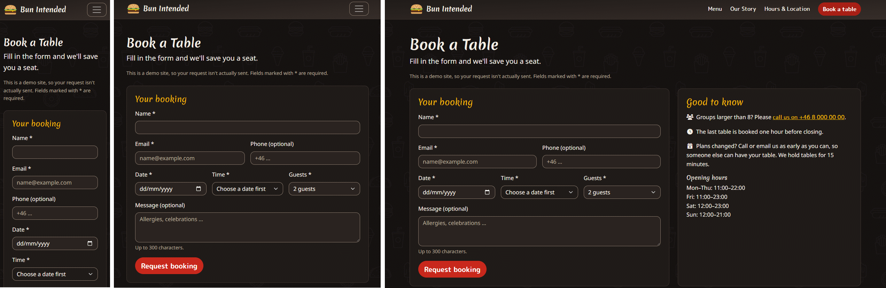
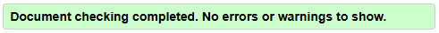
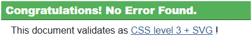
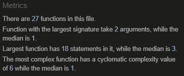
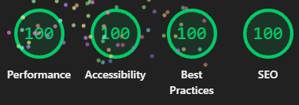
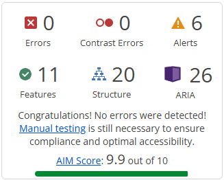

# Testing – Bun Intended

[Back to README](README.md)

## Table of contents

* [Manual testing](#manual-testing)
    * [Navigation and links](#navigation-and-links)
    * [Menu filter](#menu-filter)
    * [Open-now badge](#open-now-badge)
    * [Hours table](#hours-table)
    * [Booking form](#booking-form)
* [Responsiveness](#responsiveness)
* [Browser compatibility](#browser-compatibility)
* [Validator testing](#validator-testing)
* [Lighthouse](#lighthouse)
* [Accessibility](#accessibility)
* [Bugs](#bugs)

This project has no automated tests. All testing was done manually.

## Manual testing

### Navigation and links

| Feature | Action | Expected result | Result |
|---------|--------|-----------------|--------|
| Navbar links | Click every link on every page | Correct page opens, active link highlighted | PASS |
| Logo | Click logo | Goes to Home | PASS |
| Book button | Click in navbar and on Home | Opens Book a Table | PASS |
| Mobile menu | Tap the toggle below 992px | Menu opens and closes, links work | PASS |
| Skip link | Press Tab on page load, then Enter | Focus jumps to main content | PASS |
| Footer links | Click Allergens, Book a table, phone, email | Correct page / app opens | PASS |
| Social icons | Click each icon | Opens the platform in a new tab | PASS |
| Carousel | Use arrows and indicators | Slides change, no autoplay | PASS |
| Map | Load Hours & Location | Map shows Götgatan 42 | PASS |
| Logo animation | Load Home | Layers drop in once | PASS |
| Hero logo hover | Hover the big burger on Home, then move away | Top bun lifts and tilts and stays; falls back on mouse out; other layers don't move | PASS |
| Navbar and footer logo hover | Hover or Tab to the logo link | Top bun lifts a few pixels | PASS |
| Reduced motion | Turn on reduced motion in OS, reload | No logo animation | PASS |
| Reduced motion (hover) | Same setting, hover each logo | No lift or tilt | PASS |

### Menu filter

| Action | Expected result | Result |
|--------|-----------------|--------|
| Click "Burgers" | Only Burgers shown, button marked as pressed | PASS |
| Click "All" | Every category shown | PASS |
| Use keyboard only | Buttons reachable and work with Enter/Space | PASS |
| JavaScript disabled | Filter bar hidden, full menu shown | PASS |

### Open-now badge

| Situation (Stockholm time) | Expected text | Result |
|----------------------------|---------------|--------|
| Friday 17:40 | Open now · closes at 23:00 | PASS |
| Saturday 09:25 | Closed · opens today at 12:00 | PASS |
| Friday 23:30 | Closed · opens tomorrow at 12:00 | PASS |
| Friday 23:00 exactly | Closed · opens tomorrow at 12:00 | PASS |

### Hours table

| Situation | Expected result | Result |
|-----------|-----------------|--------|
| Load Hours & Location | "Monday – Thursday" is split into four rows, 7 rows in total | PASS |
| Any day | Today's row says "Today" and is highlighted, the next day's row says "Tomorrow", the rest keep their day names | PASS |
| Today is Saturday | Saturday row says "Today", Sunday row says "Tomorrow" | PASS |
| Page open past midnight | Labels move to the new today and tomorrow within a minute, and the old rows get their day names back | PASS |
| JavaScript disabled | Four rows with "Monday – Thursday" grouped, no labels | PASS |
| Footer (any page) | Still shows "Monday – Thursday" grouped | PASS |

### Booking form

| Action | Expected result | Result |
|--------|-----------------|--------|
| Submit empty form | Error messages on all required fields | PASS |
| Invalid email | Email error message | PASS |
| Pick a past date | Not possible / error message | PASS |
| Pick a Friday | Time slots 11:00 – 22:00 | PASS |
| Pick a Sunday | Time slots 12:00 – 20:00 | PASS |
| Pick today | Slots that have passed are not shown | PASS |
| Valid submit | Form hidden, confirmation with correct summary, focus on heading | PASS |
| "Make another booking" | Empty form shown again | PASS |

## Responsiveness

Tested with Chrome DevTools and on real devices.

| Width / device | Result |
|----------------|--------|
| 320px (small phone) | PASS |
| 375–390px (phone) | PASS |
| 768px (tablet) | PASS |
| 992px (navbar expands) | PASS |
| 1200px+ (desktop) | PASS |
| Real phone: Galaxy Fold 5 | PASS |

## Browser compatibility

| Browser | Result |
|---------|--------|
| Brave | PASS |
| Chrome | PASS |
| Firefox | PASS |
| Edge | PASS |

## Validator testing

- HTML: [W3C Markup Validator](https://validator.w3.org/) – Result for all 6 pages - PASSED
 
- CSS: [W3C Jigsaw CSS Validator](https://jigsaw.w3.org/css-validator/) – Result for `style.css` – PASSED
 
- JavaScript: [JSHint](https://jshint.com/) – every file PASSED with no errors or warnings.
  JSHint only lists problems, so a clean file shows nothing but the metrics panel.
  Each file starts with `/* jshint esversion: 6 */` so that `const`, `let` and arrow functions are accepted.

  | File | Errors | Warnings | Result |
  |------|:------:|:--------:|--------|
  | `hours.js` | 0 | 0 | PASS |
  | `open-status.js` | 0 | 0 | PASS |
  | `menu-filter.js` | 0 | 0 | PASS |
  | `booking-form.js` | 0 | 0 | PASS |

  

## Lighthouse

| Page | Performance | Accessibility | Best Practices | SEO |
|------|:-----------:|:-------------:|:--------------:|:---:|
| **Home page** | | | | |
| Desktop | 100 | 100 | 100 | 100 |
| Mobile (initial) | 74 | 100 | 100 | 100 |
| Mobile (after optimization) | 94 | 100 | 100 | 100 |
| **Menu page** | | | | |
| Desktop | 99 | 100 | 100 | 100 |
| Mobile | 94 | 100 | 100 | 100 |
| **Our Story page** | | | | |
| Desktop | 100 | 100 | 100 | 100 |
| Mobile | 92 | 100 | 100 | 100 |
| **Hours & Location page** | | | | |
| Desktop (initial)  | 83 | 100 | 100 | 100 |
| Desktop (after optimization) | 99 | 100 | 100 | 100 |
| Mobile (initial) | 74 | 100 | 100 | 100 |
| Mobile (after optimization) | 87 | 100 | 100 | 100 |
| **Book a Table page** | | | | |
| Desktop | 100 | 100 | 100 | 100 |
| Mobile | 95 | 100 | 100 | 100 |
| **Allergens page** | | | | |
| Desktop | 100 | 100 | 100 | 100 |
| Mobile | 96 | 100 | 100 | 100 |

## Accessibility

### WAVE

[WAVE](https://wave.webaim.org/) was run on every page. WAVE sorts its findings into errors (real
failures) and alerts (things a human should check). Errors must be 0. Each alert was checked by hand.

| Page | Errors | Contrast errors | Alerts | AIM score |
|------|:------:|:---------------:|:------:|:---------:|
| Home | 0 | 0 | 7 (6 after fix) | 9.9 |
| Menu | 0 | 0 | 0 | 10 |
| Our Story | 0 | 0 | 5 | 9.9 |
| Hours & Location | 0 | 0 | 2 (1 after fix) | 10 |
| Book a Table | 0 | 0 | 1 | 10 |
| Allergens | 0 | 0 | 1 | 10 |

**Alerts**

| Page | Alert | Count | Where | Decision |
|------|-------|:-----:|-------|----------|
| Home | Long alternative text | 1 | "Kale Me Maybe" card image | Fixed: the alt text was over 100 characters. Shortened to "An appetizing plant-based burger with cheese, lettuce, tomato, and onion". |
| Home | Redundant link | 1 | "Book a table" button in the CTA band | Left as is: the same link is also in the navbar and footer, but a call to action should link to the booking page. A repeated link to the same page is not a barrier for screen reader users. |
| Home | Possible heading | 5 | The four slider captions and the tagline under the `<h1>` | Left as is: they are a caption and a tagline, not section titles. Making them headings would add empty entries to the heading outline. |
| Our Story | Possible heading | 5 | The year above each timeline entry | Left as is: each entry already has an `<h3>` title. The year is a date label, and the `<time>` element is the correct markup for it. |
| Hours & Location | Noscript element | 2 | The `<noscript>` style in `<head>` and the `<noscript>` map link | The map link is fixed: it is now a normal link below the map, shown to everyone (see Bugs), so one alert goes away. The `<noscript>` style in `<head>` is left as is: it hides the empty map box for visitors without JavaScript. |
| Book a Table | Redundant link | 1 | Phone number in the footer | Left as is: the same number is linked in the info card. The footer is on every page and the number should stay visible and tappable there. |
| Allergens | Redundant link | 1 | "Back to the menu" button | Left as is: the page is reached from the menu, so a button back is helpful. It is the same link as "Menu" in the navbar, but it saves the visitor a scroll. |

### Keyboard-only walkthrough

Every page was tested with Tab, Shift+Tab, Enter, Space and Esc only.

| Check | Result |
|-------|--------|
| Skip link appears on first Tab and jumps to main content | PASS |
| Focus order follows the visual order on all pages | PASS |
| Mustard focus ring visible on every link, button and field | PASS (after fixing the navbar toggler, see Bugs) |
| Navbar toggle, carousel controls, menu filter and booking form work by keyboard | PASS |
| No keyboard traps | PASS |
| Our Story: Tab goes from navbar straight to footer | PASS (expected: the page has no links or buttons in the content) |
| Hours & Location: the Google Maps embed has many tab stops | Noted: it is a third-party embed we cannot change. The address is also given as text, and a "Open Götgatan 42 in Google Maps" link below the map gives an alternative. |

### Colour contrast

All text pairs were calculated when planning (all pass WCAG AA). WAVE then confirmed it with 0 contrast errors on all 6 pages.

## Bugs

### Fixed bugs
- **Guests select failed W3C HTML validation** (`book.html`): the validator reported that the first option of a `<select required>` must have an empty value or no text. The guests select always has a value (2 guests is preselected and cannot be cleared), so `required` did nothing. Fixed by removing the `required` attribute. The `*` stays in the label because the field is still mandatory in practice.
- **Slider text and controls were black** (`style.css`): in dark mode Bootstrap 5.3 makes the carousel "dark", with black captions, black dots and inverted arrows, which are unreadable on our dark caption pills. Fixed by overriding those rules with the same selectors, placed after Bootstrap's CSS.
- **Burger logo had a gap between the cheese and the patty** (all pages and `favicon.svg`): the cheese ended one SVG unit above the patty, which left a thin line of background showing. Fixed by changing the cheese path so it touches the patty.
- **Map showed an empty white box without JavaScript** (`hours-location.html`): Google's embedded map needs JavaScript to draw itself. Fixed by hiding the map box with a `<noscript>` style. A link to Google Maps below the map is shown to everyone (first version had it inside `<noscript>`, but it also helps keyboard and phone users). (First version hid the map in the HTML and revealed it with `map.js`, which caused a layout shift, see below.)
- **Layout shift on the Hours & Location page** (`hours-location.html`): Lighthouse reported a Cumulative Layout Shift of 0.262. The map was hidden in the HTML and revealed by JavaScript after load, so a 16:9 box suddenly appeared and pushed the photos down. Fixed by keeping the map box in the layout at all times and hiding it only when JavaScript is off.
- **Navbar toggler had no mustard focus ring** (`style.css`): found in the keyboard walkthrough. Bootstrap removes the toggler's outline with `.navbar-toggler:focus`, which is more specific than our global `:focus-visible` rule, so it won. Fixed by adding a `.navbar-toggler:focus-visible` rule with the mustard outline.
- **Footer logo lifted when hovering the text** (`style.css`): the top bun reacted to hover on the whole "Bun Intended" name in the footer, which broke the rule that hover effects are only for links, buttons and the burger itself. Fixed by tying the hover effect to `.logo-burger` instead of `.brand-name`.
- **Hero logo hover was instant and too strong** (`style.css`): the small-logo hover rules also matched the big hero logo (both have the class `logo-burger`) and replaced its own transition, so the top bun jumped instead of moving smoothly. Fixed by excluding `.hero-logo` from those rules, and by making the hero effect slower (0.35s) and gentler (lift 16 units, tilt 13°).
- **Timeline dots sat too high** (`style.css`): the dots were not aligned with the year text next to them. Fixed by moving them down (`top: 0.4rem`).

### Unfixed bugs
- None known
