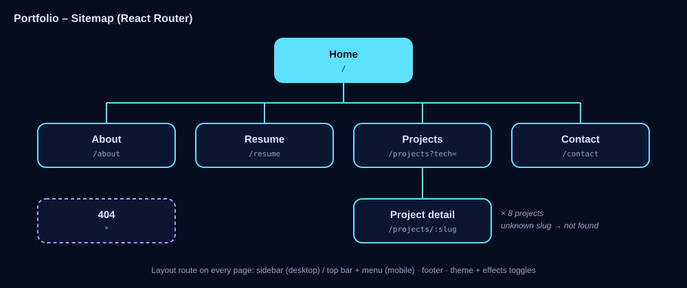
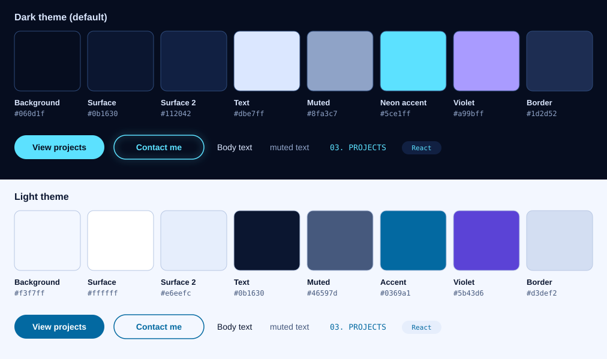
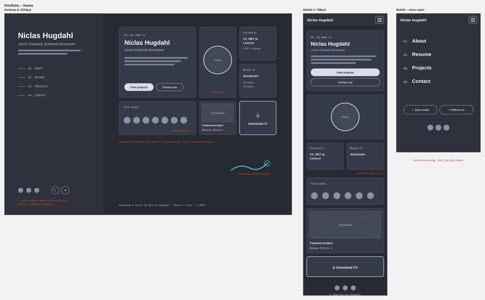
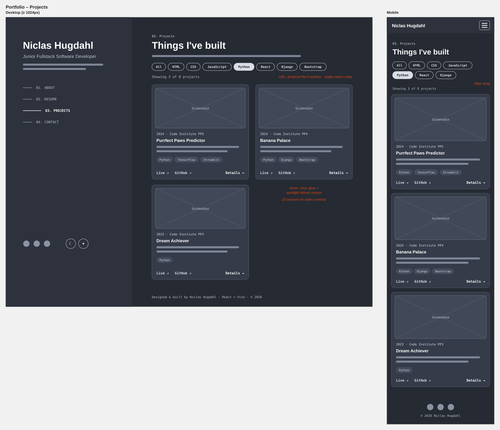
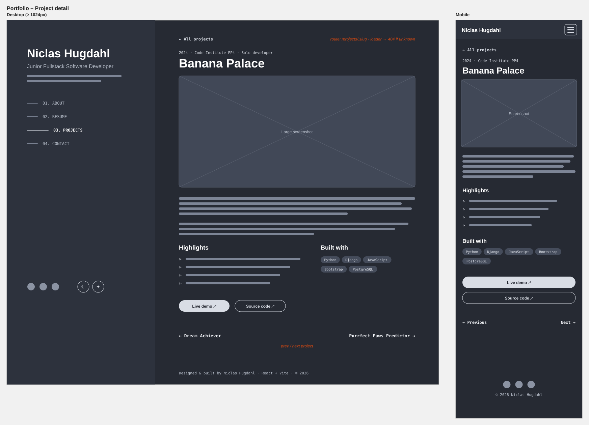
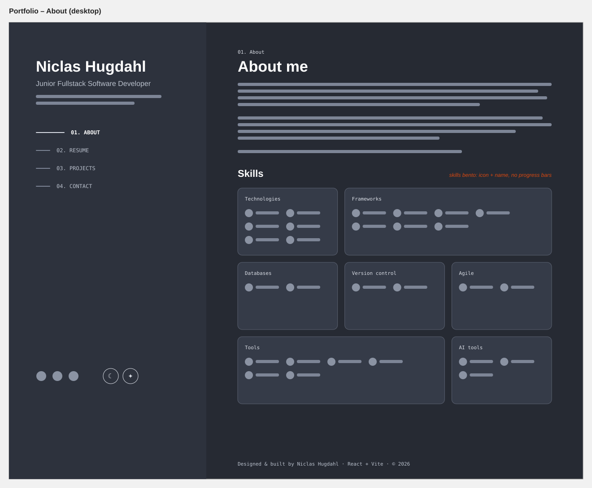
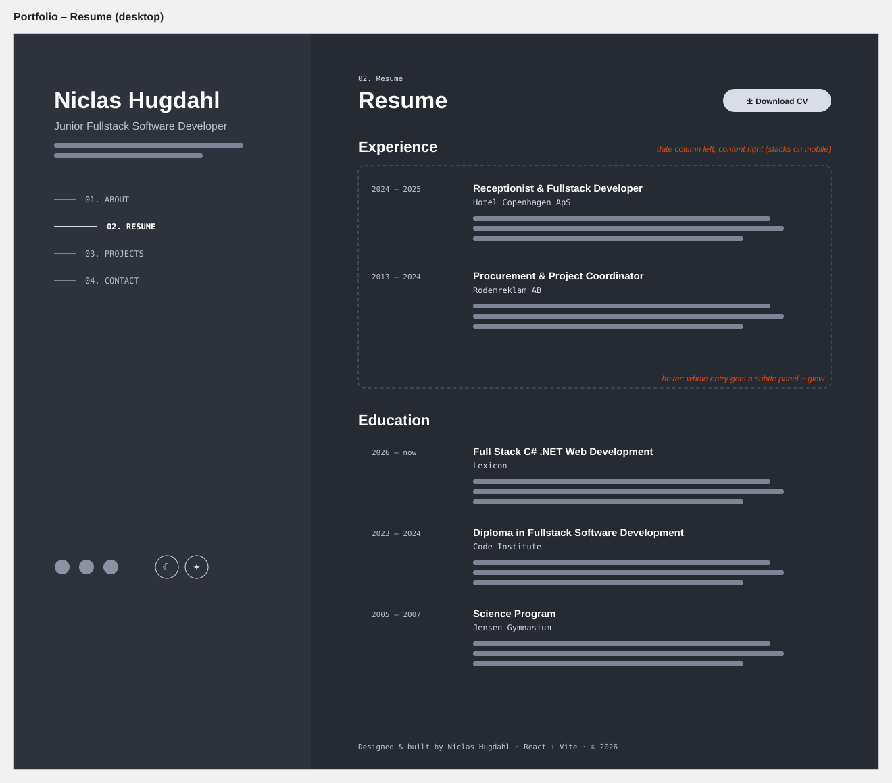
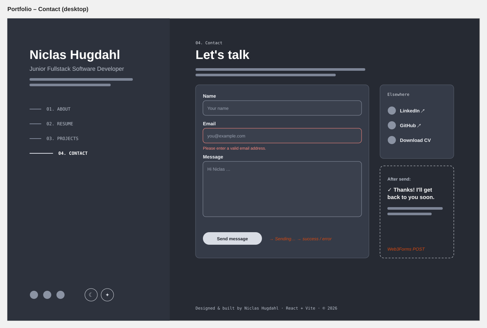

# Niclas Hugdahl – Developer Portfolio

TODO: Am I Responsive screenshot → `readme-assets/screenshots/am-i-responsive.png`

<!--  -->

Link to live website: [Niclas Portfolio](https://frontend-projects-phi-topaz.vercel.app/)

<hr>

## Table of contents

* [User Experience (UX)](#user-experience-ux)
    * [Target audience](#target-audience)
    * [User stories](#user-stories)
        * [Site owner goals](#site-owner-goals)
        * [Visitor goals](#visitor-goals)
* [Design](#design)
    * [Sitemap](#sitemap)
    * [Layout](#layout)
    * [Colours](#colours)
    * [Typography](#typography)
    * [Effects and animations](#effects-and-animations)
    * [Images](#images)
    * [Wireframes](#wireframes)
    * [Accessibility](#accessibility)
* [Features](#features)
    * [Navigation and layout](#navigation-and-layout)
    * [Home bento grid](#home-bento-grid)
    * [About and skills](#about-and-skills)
    * [Resume](#resume)
    * [Projects and filter](#projects-and-filter)
    * [Project detail pages](#project-detail-pages)
    * [Contact form](#contact-form)
    * [Theme and effects toggles](#theme-and-effects-toggles)
    * [404 page](#404-page)
    * [The footer](#the-footer)
* [React structure](#react-structure)
    * [Routing](#routing)
    * [Components and data](#components-and-data)
    * [State and context](#state-and-context)
* [Future features](#future-features)
* [Technologies used](#technologies-used)
    * [Languages](#languages)
    * [Frameworks & Libraries](#frameworks--libraries)
    * [Tools](#tools)
* [Testing](#testing)
* [Deployment](#deployment)
    * [Local development](#local-development)
* [Credits](#credits)
    * [Content](#content)
    * [Media](#media)
    * [Code](#code)


## User Experience (UX)

This is my personal developer portfolio. It presents who I am, what I can
do and what I have built, so recruiters and developers can quickly get a
clear picture of me as a junior fullstack developer. It is a multi-page
React application with a deep dark blue theme, light-blue neon effects and
a layout inspired by modern developer portfolios.

This project is Project 3 of the frontend part of the C# course at Lexicon,
bringing together everything from the earlier projects (HTML, CSS,
responsive design, JavaScript) with React, React Router and automated tests.

### Target audience
- **Recruiters and hiring managers** looking for a junior developer: they
  want a quick overview of skills, experience and proof of work.
- **Developers and tech leads** reviewing a candidate: they want to look
  closer at projects, code and quality.
- **Teachers** assessing the course project.

### User stories

#### Site owner goals
- Make a strong first impression as a professional, modern developer
- Showcase my projects with screenshots, live demos and source code
- Present my skills, experience and education clearly
- Make it easy to contact me or download my CV
- Show that I care about UX, accessibility, performance and testing

#### Visitor goals
- Understand who Niclas is and what he does within seconds
- Find projects that use a specific technology
- Read more about a project and open the live demo or the code
- See experience and education at a glance
- Get in touch without having to look for an email address
- Choose dark or light mode, and turn off animations if they're distracting


## Design

### Sitemap



### Layout

On desktop the site uses a split layout inspired by
[Brittany Chiang's portfolio](https://brittanychiang.com/): my name,
title, navigation and settings stay fixed on the left while the pages
scroll on the right. The home page and the skills section use **bento
grids**, tiles of different sizes that make a lot of information easy to
scan. On tablet and mobile the navigation moves into a top bar with a
full-screen menu.

### Colours

The main theme is a deep dark blue with light-blue "neon" accents. A light
theme is also available. All text colours meet WCAG AA contrast in both
themes. In light mode the neon glow is toned down to soft blue shadows,
so text stays readable.



| Role | Dark (default) | Light |
|------|----------------|-------|
| Background | `#060d1f` | `#f3f7ff` |
| Surface | `#0b1630` | `#ffffff` |
| Text | `#dbe7ff` | `#0b1630` |
| Muted text | `#8fa3c7` | `#46597d` |
| Accent (neon) | `#5ce1ff` | `#0369a1` |
| Secondary accent | `#a99bff` | `#5b43d6` |

### Typography

- **Space Grotesk** is used for headings: modern and technical, with a lot of character
- **Inter** is used for body text: designed for screens and very readable
- **JetBrains Mono** is used for small labels, dates and tags: a code font that fits a developer portfolio

All fonts are self-hosted with Fontsource, so no requests go to Google Fonts.

### Effects and animations

- A light-blue neon **trail follows the mouse cursor**, drawn on a canvas
- A **custom cursor** (dot + glowing ring) that grows over links and buttons
- **Neon glow** on hover and keyboard focus
- A **spotlight** that follows the mouse inside the bento tiles on the Home and About pages
- Smooth **page transitions** and **scroll reveals** with Motion

To keep the site fast and comfortable, the effects are turned off
automatically on touch devices and for visitors who prefer reduced motion,
and anyone can switch them off with the effects toggle. They were tuned with
Chrome's 4× CPU throttling, which is why, for example, the spotlight is only
on the bento tiles and not on the project cards.

TODO: GIF of the cursor trail and hover effects

### Images

TODO: profile photo + how project screenshots were made (Am I Responsive, resized, WebP)

### Wireframes

Simple wireframes were made before coding. The final design may differ.

<details><summary>Home – desktop and mobile</summary> <p align="left"></p> </details>

<details><summary>Projects – desktop and mobile</summary> <p align="left"></p> </details>

<details><summary>Project detail – desktop and mobile</summary> <p align="left"></p> </details>

<details><summary>About – desktop</summary> <p align="left"></p> </details>

<details><summary>Resume – desktop</summary> <p align="left"></p> </details>

<details><summary>Contact – desktop</summary> <p align="left"></p> </details>

### Accessibility

- Semantic HTML with landmarks, one `<h1>` per page and a "Skip to content" link
- When the route changes, focus moves to the new page heading and the page title updates, so screen reader users know the page changed
- The active page is marked with `aria-current`, and the mobile menu, toggles and filter buttons use the right ARIA states
- Visible neon focus ring on everything that can be focused
- Form fields have labels, and error messages are linked to their fields
- All animations respect reduced-motion settings and can be turned off
- WCAG AA colour contrast in both themes

TODO: add screenshot examples of responsive behaviour


## Features

### Navigation and layout

TODO: description + screenshot (desktop sidebar + mobile menu)

### Home bento grid

TODO: description + screenshot

### About and skills

TODO: description + screenshot

### Resume

TODO: description + screenshot

### Projects and filter

Projects can be filtered by programming language or framework. The
selected filter is stored in the URL (for example `/projects?tech=react`),
so it survives a page refresh, works with the browser's back button and
can be shared as a link.

TODO: screenshot

### Project detail pages

Each project has its own page (`/projects/banana-palace`) with a larger
screenshot, description, highlights, technologies and links to the live
demo and source code.

TODO: screenshot

### Contact form

The contact form validates every field and really sends the message
through Web3Forms. While it is sending the button shows a loading state,
and visitors see a clear success or error message afterwards.

TODO: screenshot

### Theme and effects toggles

TODO: description + screenshot of dark vs light mode

### 404 page

TODO: description + screenshot

### The footer

TODO: description + screenshot


## React structure

### Routing

The app uses **React Router v8** in data mode. All routes are defined in
one file (`src/routes.jsx`), and that file is reused in the integration
tests. A shared layout route renders the sidebar/header and an
`<Outlet />` for the pages. Project detail pages use a **route parameter**
(`:slug`) and a **loader** that shows a "not found" page for unknown
projects. The projects filter uses **search parameters**.

### Components and data

All content (profile, skills, experience, education and projects) lives in
plain JavaScript data files in `src/data/`, and reusable components render
it as lists. Every component has its own folder with a JSX file, a
**CSS Module** and a test file.

TODO: short folder tree when the project is finished

### State and context

- Local state: contact form status, mobile menu open/closed
- URL state: the active project filter (`useSearchParams`)
- Context: theme and effects settings, shared by the whole app and saved in `localStorage` with a custom `useLocalStorage` hook


## Future features
- TODO: add ideas that come up during development (GitHub stats, blog, Swedish translation …)


## Technologies used

### Languages
- HTML
- CSS (CSS Modules)
- JavaScript (JSX)

### Frameworks & Libraries
- React 19
- React Router 8
- Vite 8
- Motion (animations)
- React Icons
- Fontsource (self-hosted fonts)
- Web3Forms (contact form delivery)
- Vitest, React Testing Library, jsdom (testing)

### Tools
- Git
- GitHub
- Vercel
- VS Code
- ESLint and Prettier
- Claude (planning)
- Claude Code (implementation)
<!-- - ChatGPT (image edit) -->
- Paint.NET (cropping images)
- Squoosh (resizing / WebP conversion)
- TODO: add other tools used

## Testing

Testing made in separate file [TESTING.md](TESTING.md)


## Deployment

This project lives in the monorepo
[frontend-projects](https://github.com/NiclO1337/frontend-projects), in the
folder `project3-portfolio-website`. Changes were continuously pushed to
GitHub for source control.<br>
The site is deployed to Vercel as its own project. The steps to deploy are as follows:
- Log in to Vercel with GitHub, click **Add New → Project** and import the `frontend-projects` repository
- Set **Root Directory** to `project3-portfolio-website`
- Framework Preset **Vite** is detected automatically (build command `npm run build`, output directory `dist`)
- Under **Settings → Build and Deployment**, set the Node.js version to 24.x, and set **Ignored Build Step** to *Only build if there are changes in a folder* with the command `git diff HEAD^ HEAD --quiet -- .`
- Under **Settings → Environment Variables**, add `VITE_WEB3FORMS_KEY`
- Click **Deploy**. Vercel redeploys automatically on every push to `main`

`vercel.json` rewrites all paths to `index.html`. Without it, refreshing a
page like `/projects` would give a 404, because the routes only exist in
React Router, not as files.

Link to live website: [Niclas Portfolio](https://frontend-projects-phi-topaz.vercel.app/)

### Local development

#### Forking the project for local development

- Log in (or sign up) to GitHub.
- Go to the repository for this project, [link to repository](https://github.com/NiclO1337/frontend-projects)
- Click the Fork button in the top right corner.

#### Cloning the project for local development

- Log in (or sign up) to GitHub.
- Go to the repository for this project, [link to repository](https://github.com/NiclO1337/frontend-projects)
- Click on the code button, select whether you would like to clone with HTTPS, SSH, or GitHub CLI, and copy the link shown.
- Open the terminal in your code editor and change the current working directory to the location you want to use for the cloned directory.
- Type `git clone` into the terminal and then paste the link you copied in step 3.
- Press enter.

#### Running the project

Requires Node.js 22.22 or newer.

```bash
cd project3-portfolio-website
npm install
cp .env.example .env      # add your own Web3Forms access key
npm run dev               # start the dev server
npm test                  # run the tests
```


## Credits

### Content
- All text is my own, based on my CV.

### Media
- TODO: profile photo
- Project screenshots made with [Am I Responsive](https://ui.dev/amiresponsive)
- Icons from [React Icons](https://react-icons.github.io/react-icons/) (Font Awesome and Simple Icons)
- Fonts: Space Grotesk, Inter and JetBrains Mono via [Fontsource](https://fontsource.org/)

### Code
- Layout inspired by [Brittany Chiang's portfolio](https://brittanychiang.com/)
- [React Router documentation](https://reactrouter.com/)
- [Motion documentation](https://motion.dev/)
- [Vitest](https://vitest.dev/) and [Testing Library](https://testing-library.com/) documentation
- Took inspiration from Kera Cudmore's very comprehensive README guide: [Readme examples.](https://github.com/kera-cudmore/readme-examples)
- TODO: add tutorials, videos or articles used during development
